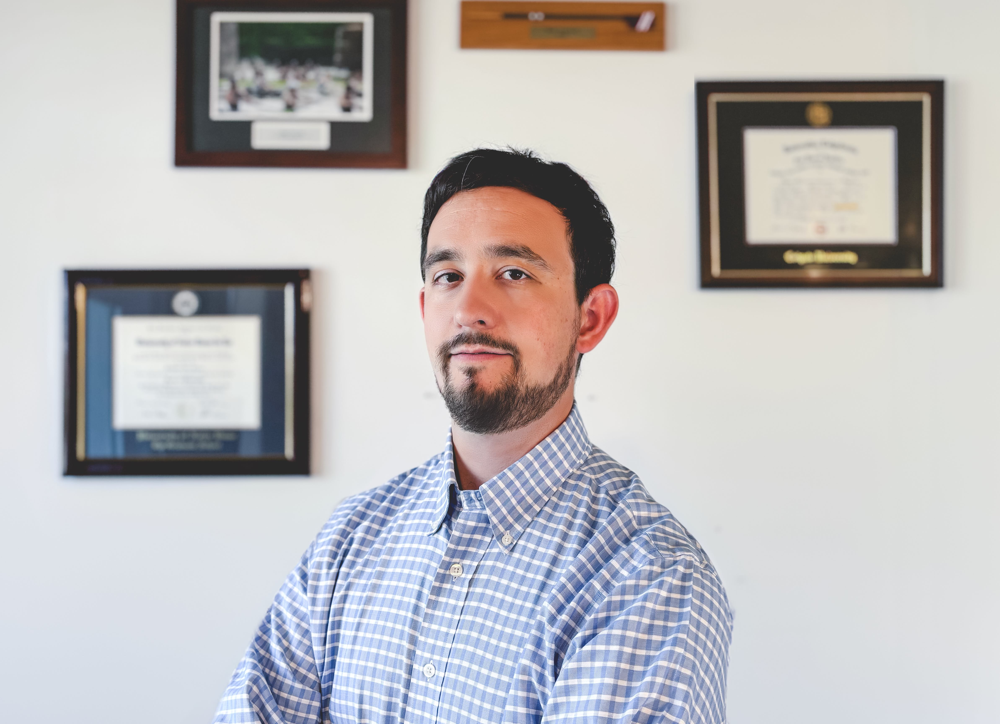

    

        

            
        

        

            
<h2>I am a Research Scientist with the Canadian Centre for Climate Modelling and Analysis (CCCma)</h2>
 based in Victoria, BC, Canada. I’m also an Adjunct Faculty of Graduate Studies in the Department of Earth and Environmental Sciences at Dalhousie University. Before this, I was an interchange Canada post-doctoral fellow jointly with the climate processes section of Environment and Climate Change Canada (<a href="https://joemelton.weebly.com">Joe Melton</a>) and Carleton University (<a href="https://carleton.ca/cubiomet/">Elyn Humphreys</a>). I led the development of a Canada-specific version of the Canadian Land Surface Scheme, Including Biogeochemical Cycles (CLASSIC), annual meetings, and other external engagement efforts.

            
Before my post-doc, I completed my Ph.D. in Biological Sciences at the University of Notre Dame (<a href="https://sites.nd.edu/rocha-laboratory/">Adrian Rocha</a>). My work at the University of Notre Dame was funded by a National Science Foundation Graduate Research Fellowship (NSF GRFP), the Fulbright U.S. student program, and National Geographic. I earned my A.B. in Political Science and Geography (<a href="https://mloranty.github.io">Mike Loranty</a>) at Colgate University. As an undergraduate, I carried out fieldwork in Northeastern Siberia with the <a href="https://www.thepolarisproject.org">Polaris Project</a>.
            

                <a href="mailto:CurasiSR@gmail.com" class="btn-filled">Email Me</a>
                <a href="https://drive.google.com/file/d/1hLyNh3ZT8pqtc9sXPmbK-_wxUFaJ9qTX/view?usp=sharing" class="btn-outline">View My CV</a>
            

        

    

    

       

            

                
            

            

                
            

            

                
            

        

    

