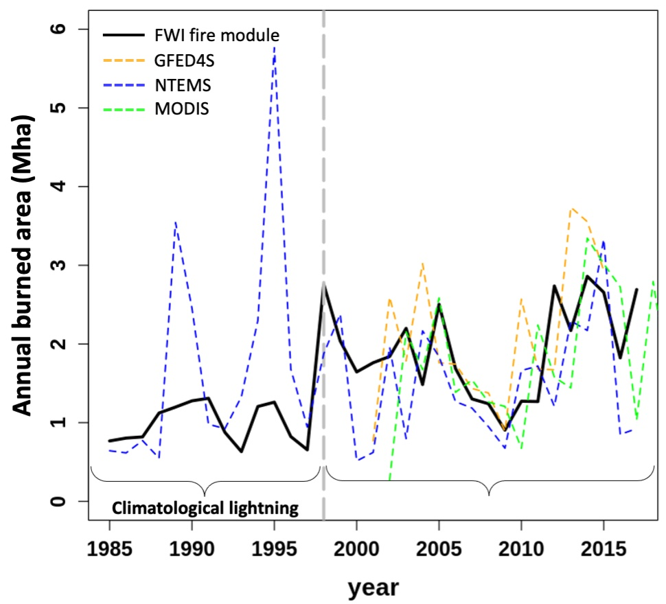
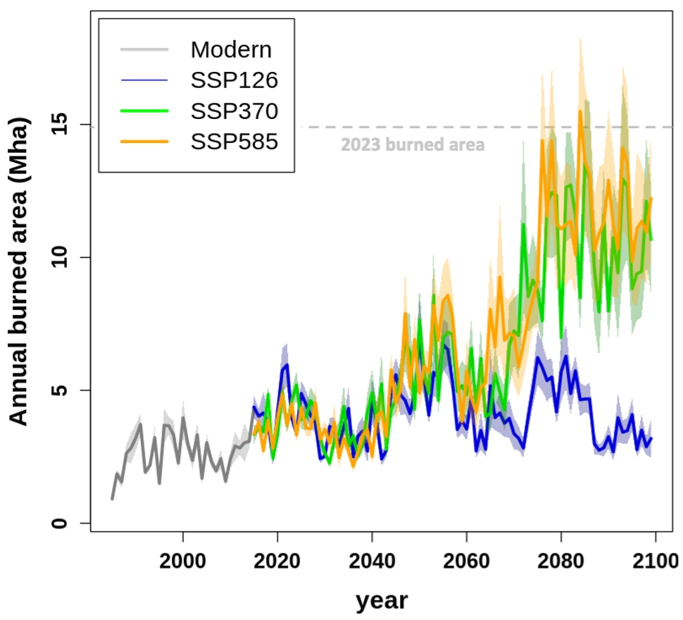
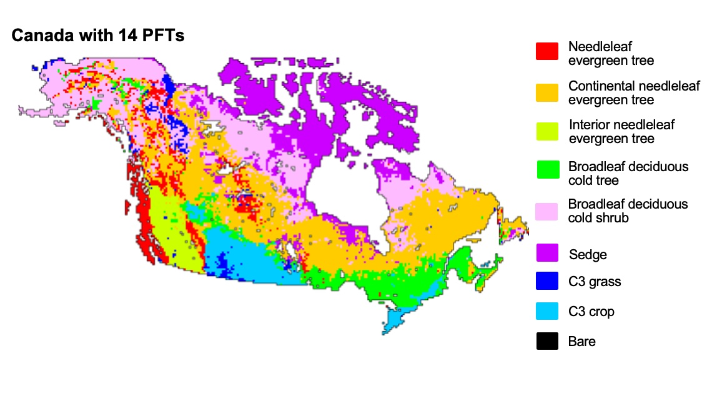
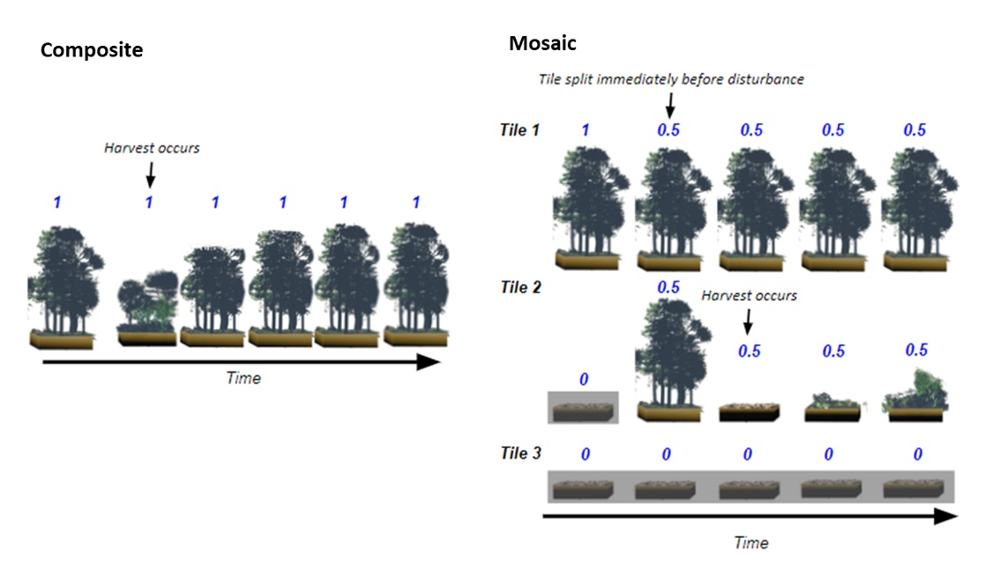
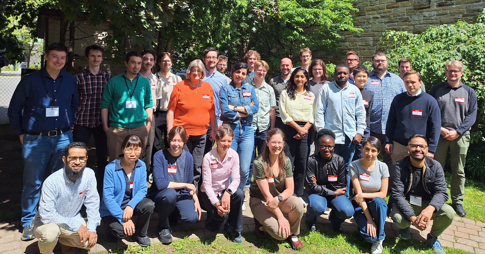

     
    

        <h1>Wildfire & Canada's carbon cycle</h1>
        
This work has focused on advancing the representation of the Canadian carbon cycle in CLASSIC. This includes improving the representation of boreal vegetation cover, wildfire, timber harvest, and vegetation recovery post-disturbance. These processes are key to understanding the historical and future response of Canada's terrestrial carbon cycle to climate, disturbances, and evolving atmospheric greenhouse gas concentrations. This project resulted in the creation of a new boreal fire model in CLASSIC and some of the first projections of future Canada-wide burned area from a land surface model.

    

    

        

            

                
            

            

                
Evaluation of the new CLASSIC FWI fire model over the historical period

            

        
 
        

            

                
            

            

                
Projections of Canada-wide burned area using CLASSIC under several common SSPs

            

        

        

    

&nbsp;

    

        
I developed a version of CLASSIC that uses Canada-specific PFTs and represents subgrid-scale heterogeneity resulting from disturbance. These model developments were benchmarked and evaluated to quantitatively demonstrate their impact on model performance. Finally, in my role as a post-doc, I organized annual workshops focused on Canada's terrestrial carbon cycle in 2022, 2023, and 2024 involving 120+ researchers from 20+ academic and government institutions.

    

&nbsp;

    

        

            

                
            

                
CLASSIC with Canada-specific PFTS (map of dominant PFTs)

        

        

            

                
            

                
CLASSICs mosaic representation of sub-grid scale heterogeneity resulting from disturbance

&nbsp;

        

    

    
    
  Canada's Carbon Cycle workshop group photo

 

    Publications:
        <ul>
            <li><a href="https://doi.org/10.1038/s41612-024-00781-4">NPJ climate and atmospheric sciences (future Canadian wildfire)</a></li>
            <ul>
                <li><a href="https://communities.springernature.com/posts/global-climate-change-below-2-c-avoids-large-end-century-increases-in-burned-area-in-canada">Behind the paper plain language accompaniment</a></li>
            </ul>
            <li><a href="https://doi.org/10.5194/gmd-17-2683-2024">GMD (disturbance and sub-grid scale heterogeneity)</a></li>
            <li><a href="https://doi.org/10.1029/2022MS003480">Publication in JAMES (CLASSIC tailored to Canada)</a></li>
        </ul>
        Collaborative publications:
        <ul>
            <li><a href="https://doi.org/10.5194/bg-20-2265-2023">Beaver et al., preprint in review (Canada domain disturbance forcings)</a></li>
            <li><a href="https://doi.org/10.5194/bg-20-2265-2023">(https://doi.org/10.1038/s41612-024-00841-9
)">Kirchmeier-Young et al., 2024 NPJ climate and atmospheric sciences (2023 wildfire attribution and emissions)</a></li>
            <li><a href="https://doi.org/10.5194/bg-20-2265-2023">Wang et al., 2023 (vegetation cover in CLASSIC)</a></li>
        </ul>
        Workshops & meetings:
        <ul>
            <li><a href="https://cccma.gitlab.io/classic_pages/info/2024workshop/">2024 COHERENT-C/CLASSIC Workshop</a></li>
            <li><a href="https://www.meet-here.ca/cgu2024/Program">2024 Canadian Geophysical Union Session</a></li>
            <li><a href="https://cccma.gitlab.io/classic_pages/info/2023workshop/">2023 COHERENT-C/CLASSIC Workshop</a></li>
            <li><a href="https://cccma.gitlab.io/classic_pages/info/2022workshop/">2022 COHERENT-C/CLASSIC Workshop</a></li>
            <li><a href="https://cmos.ca/uploaded/web/congress/Files/2022%20Files/CMOS-CGU-ESC-2022Sessions-E.pdf">2022 Canadian Geophysical Union Session</a></li>
        </ul>
    </ul>

    <a href="../tussocks" class="projnav">Next project →</a>

    

       

            

                
            

            

                
            

            

                
            

        

    

