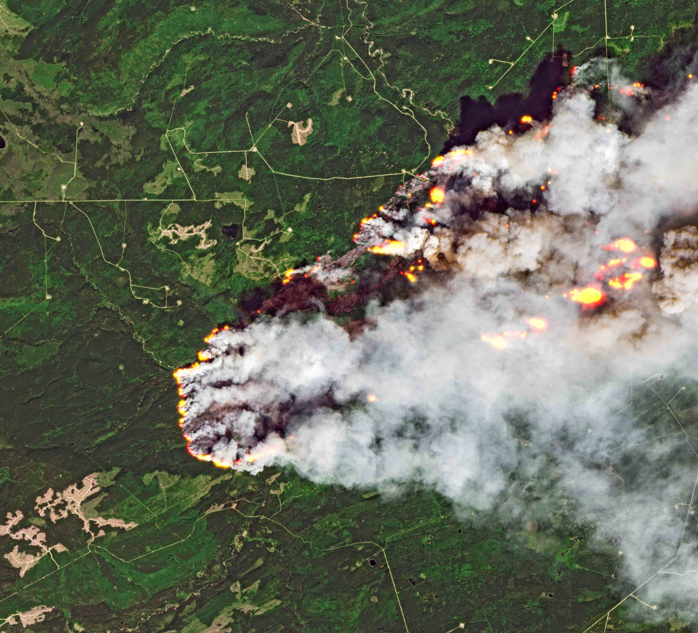
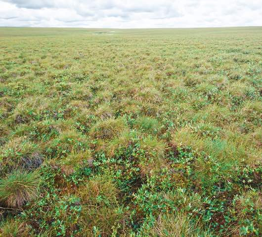
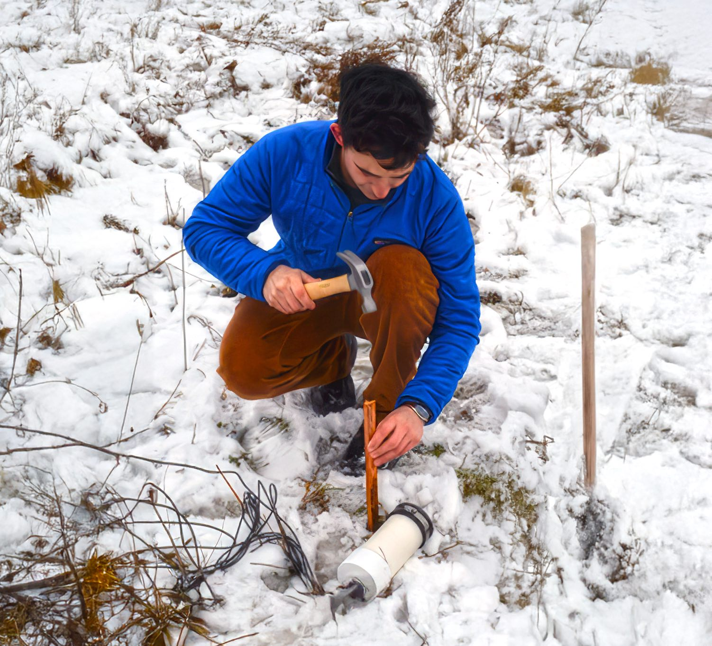
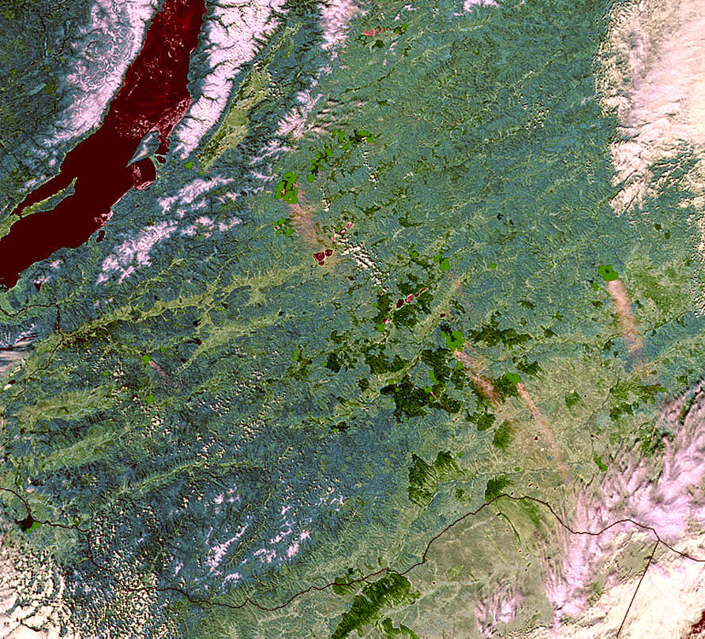

<head> 
    
</head>

    

        <h1>Hi, I’m Salvatore R. Curasi</h1>
        
I’m a Research Scientist with the Canadian Centre for Climate Modelling and Analysis (CCCma). My interests are at the nexus of climate change science, land surface modeling, and ecology. I am actively involved in the development and evaluation of the Canadian Land Surface Scheme Including Biogeochemical Cycles (CLASSIC) and its parent the Canadian Earth System Model (CanESM). Below are my most recent research projects:

    

    

        

            <a href="canada">
                
                <h3> Wildfire & Canada's carbon cycle </h3>
                
Improving models of boreal vegetation and disturbance to understanding Canada's terrestrial carbon cycle →

            </a>
        

        

            <a href="tussocks">
                
                <h3> Tussocks in Tundra Ecosystems </h3>
                
Improving our understanding of how climate change impacts vegetation carbon stocks in tussock tundra ecosystems →
   
            </a> 
        

    

    

        

            <a href="loggers">
                
                <h3> Open-source soil temperature data logger </h3>
                
 Designed to Increase the density of soil and air temperature measurements to better understand ecosystems →

            </a>
        

        

            <a href="more">
                
                <h3> Other collaborative publications </h3>
                
 Broader publications that integrate models and data to understand ecosystems and climate change →

            </a>
        

    

    

        <h3>Recent publications</h3>
        

            
You can flip through abstracts from recent publications in the carousel below.

        

    

        <iframe src="https://scurasi.github.io/pub-flipper/flipper/PDF-Flip/index.html" frameborder="0" allowfullscreen width="100%" height="600"></iframe>
    

    

       

            

                
            

            

                
            

            

                
            

        

    

