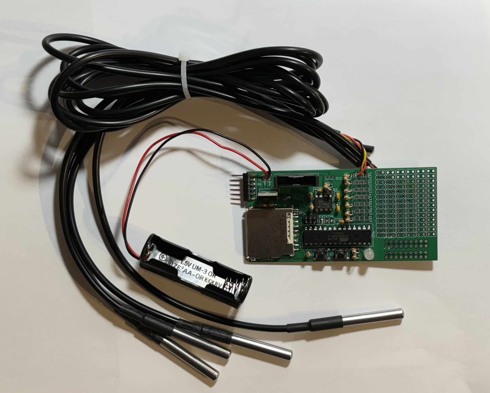
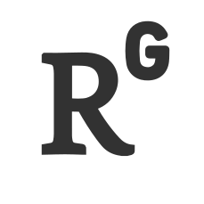

 

<h1>Developing an open-source soil temperature data logger</h1>

    

        

            

            
Conventional data loggers for measuring soil temperature are expensive and inaccessible due to their closed-source designs. Increasing the density of soil and air temperature measurements will enhance our understanding of soil temperature and microclimate and their impacts on organisms (e.g. species distributions). We tested data loggers constructed by students, with little prior electronics experience, in the lab, and in the field in Alaska. The do-it-yourself data logger was comparably accurate to a commercial system, reliable, and ~1.7–7 times less expensive.

        

        

            

                
        

    

   

    Publications:
    <ul>
        <li><a href="https://doi.org/10.3390/s22010148">Sensors: An Open-Source, Durable, and Low-Cost Alternative to Commercially Available Soil Temperature Data Loggers</a></li>
    </ul>
    Codebase:
    <ul>
        <li><a href="https://github.com/RochaLabND/SoilTemperatureLogger">Github: Code and design repository</a></li>
    </ul>
    Archive:
    <ul>
        <li><a href="https://doi.org/10.5281/zenodo.5781439">Zenodo: Archive of the code and design repository</a></li>
    </ul>

    <a href="../tussocks" class="projnav">← Previous project</a>
    <a href="../more" class="projnav">Next project →</a>

    

       

            

                
            

            

                
            

            

                
            

        

    

